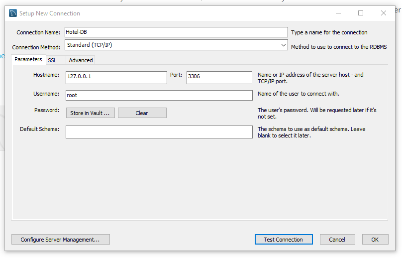
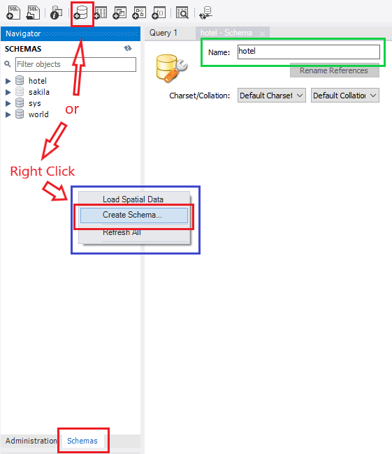
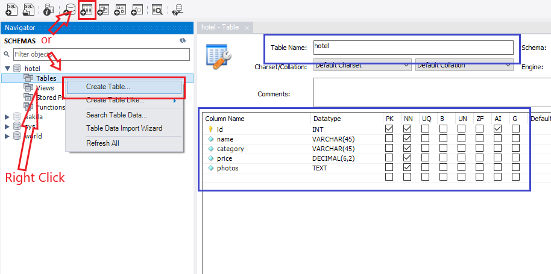
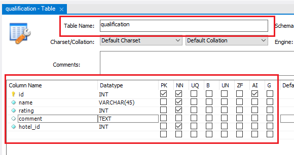

# Hotel Backend

- [Local Configuration](#local-configuration)
- [Populate Database](#populate-database)

This is the backend for a simple hotel website where you can view, create, edit, and delete the hotels. Also you could give a rating and a comment to the hotels.

## Local Configuration
- Create Database

	You have to create a database in your local machine to simulate the backend with the following datas:
	- Connection Name: Hotel-DB
	- Hostname:        127.0.0.1
	- Port:            3306
	- Username: root
	- Password: root

	

- Create Schema

	Preferably we want to create a new schema to keep our project separated from the others databases. In our case we are going to named `hotel`<br>
	

- Create Tables

	Now we can create our tables.<br>
	For this project we are going to create 2 tables with the following columns.
	- hotel
		- id: INT (PK, NN, AI)
		- name: VARCHAR(45) (NN)
		- category: INT (NN)
		- price: DECIMAL(6, 2) (NN)
		- photos: TEXT (NN)

	

	- qualification
		- id: INT (PK, NN, AI)
		- name: VARCHAR(45) (NN)
		- rating: INT (NN)
		- comment: TEXT
		- hotel_id: INT (NN)

	

## Populate Database
This part is optional, but recommended.

With this code we can populate our database with hotels and comments.
```sql
INSERT INTO
	hotel.hotel(id, name, category, price, photos)
VALUES
	("1", "Hotel El Panama", 3, 85, "[\"https://www.elpanama.com/cache/b2/50/b25096c41589d4a596b33bd42a6ef341.jpg\", \"https://www.elpanama.com/cache/73/6a/736a1c50ec9bc4f2635c56629398dbaf.jpg\"]"),
    ("2", "Playa Blanca", 4, 60, "[\"https://image-tc.galaxy.tf/wijpeg-yhqvhez3v7zwlvztbsofsyc9/file.jpg?width=1200\", \"https://image-tc.galaxy.tf/wijpeg-7dl1lz5bl4pd157uhwugpkjmy/file.jpg?height=300\"]"),
    ("3", "Hard Rock Panama Megapolis", 4, 75, "[\"https://www.hrhpanamamegapolis.com/files/1918/hardrock_fachadasalones-095R.jpg\"]"),
    ("4", "La Casita de Don Daniel", 5, 50, "[\"https://exp.cdn-hotels.com/hotels/37000000/36400000/36392600/36392544/b582d6df_z.jpg?impolicy=fcrop&w=1000&h=666&q=medium\", \"https://exp.cdn-hotels.com/hotels/37000000/36400000/36392600/36392544/e251e6d8_z.jpg?impolicy=fcrop&w=1000&h=666&q=medium\"]"),
    ("5", "Bijao Beach Resort", 3, 65, "[\"https://exp.cdn-hotels.com/hotels/73000000/72100000/72094600/72094557/w862h528x0y1-6451500c_z.jpg?impolicy=fcrop&w=1000&h=666&q=medium\"]"),
    ("6", "Las Catalinas Anton", 2, 48, "[\"https://exp.cdn-hotels.com/hotels/75000000/74740000/74730100/74730087/1f9a99ac_z.jpg?impolicy=fcrop&w=1000&h=666&q=medium\"]"),
    ("7", "Hospedaje Las Uvas", 2, 56, "[\"https://exp.cdn-hotels.com/hotels/75000000/74610000/74600200/74600197/df0340e0_z.jpg?impolicy=fcrop&w=1000&h=666&q=medium\"]"),
    ("8", "Las Catalinas Coronado", 1, 61, "[\"https://exp.cdn-hotels.com/hotels/20000000/19930000/19926800/19926786/0cd65f04_z.jpg?impolicy=fcrop&w=1000&h=666&q=medium\", \"https://exp.cdn-hotels.com/hotels/20000000/19930000/19926800/19926786/d75a3e79_z.jpg?impolicy=fcrop&w=1000&h=666&q=medium\"]"),
    ("9", "Punta Chame Club and Resort", 3, 60, "[\"https://exp.cdn-hotels.com/hotels/36000000/35790000/35788200/35788189/d1a80cea_z.jpg?impolicy=fcrop&w=1000&h=666&q=medium\"]"),
    ("10", "El Litoral", 5, 75, "[\"https://exp.cdn-hotels.com/hotels/19000000/18720000/18719000/18718960/3df54256_z.jpg?impolicy=fcrop&w=1000&h=666&q=medium\", \"https://exp.cdn-hotels.com/hotels/19000000/18720000/18719000/18718960/34de1023_z.jpg?impolicy=fcrop&w=1000&h=666&q=medium\"]"),
    ("11", "Movich Hotel Las Lomas", 3, 85, "[\"https://exp.cdn-hotels.com/hotels/1000000/520000/519900/519824/4d45af49_z.jpg?impolicy=fcrop&w=1000&h=666&q=medium\"]"),
    ("12", "York Luxury Suites Medellín", 3, 45, "[\"https://exp.cdn-hotels.com/hotels/50000000/49090000/49084200/49084142/c2db5d7f_z.jpg?impolicy=fcrop&w=1000&h=666&q=medium\", \"https://exp.cdn-hotels.com/hotels/50000000/49090000/49084200/49084142/267054c6_z.jpg?impolicy=fcrop&w=1000&h=666&q=medium\"]"),
    ("13", "Hospedaje Ecológico en Maloka", 2, 55, "[\"https://exp.cdn-hotels.com/hotels/59000000/58330000/58328200/58328183/7d409ea4_z.jpg?impolicy=fcrop&w=1000&h=666&q=medium\"]");
```

```sql
INSERT INTO
	hotel.qualification(name, rating, comment, hotel_id)
VALUES
	("User 01", 4, "", 1),
    ("User 02", 2, "not good", 1),
    ("User 03", 5, "good", 1),
    ("User 04", 3, "so so", 2),
    ("User 05", 2, "good", 2),
    ("User 06", 3, "", 3),
    ("User 07", 1, "not good", 3),
    ("User 08", 2, "", 3),
    ("User 09", 5, "", 3),
    ("User 10", 4, "", 3),
    ("User 11", 4, "ok", 4),
    ("User 12", 4, "Good experience", 5),
    ("User 13", 3, "", 5),
    ("User 14", 3, "", 5),
    ("User 15", 2, "not good", 6),
    ("User 16", 5, "Very great!", 6),
    ("User 17", 1, "bad", 7),
    ("User 18", 2, "", 7),
    ("User 19", 5, "", 7),
    ("User 20", 4, "ok", 7),
    ("User 21", 2, "not ok", 8),
    ("User 22", 5, "fantastic", 8),
    ("User 23", 4, "", 9),
    ("User 24", 4, "", 10),
    ("User 25", 3, "so so", 10),
    ("User 26", 3, "", 10),
    ("User 27", 4, "", 11),
    ("User 28", 4, "ok", 11),
    ("User 29", 5, "", 12),
    ("User 30", 4, "", 13),
    ("User 31", 1, "", 13),
    ("User 32", 3, "not good", 13);
```